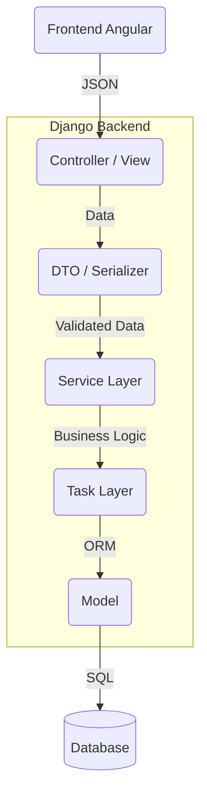

# Sistema de Gestão de Pessoas (Fullstack)

Este projeto é uma solução completa para o gerenciamento de cadastro de pessoas, desenvolvida como parte de um processo seletivo. A aplicação segue uma arquitetura robusta e moderna, separando claramente as responsabilidades entre Backend (Django) e Frontend (Angular).

## 🌟 Funcionalidades

- **CRUD Completo:** Criação, Leitura, Atualização e Exclusão de registros de pessoas.
- **Pesquisa Avançada:** Filtragem combinada por nome e sexo.
- **Paginação:** Navegação eficiente entre grandes volumes de dados.
- **Cálculo de Peso Ideal:** Funcionalidade bônus que calcula o peso ideal baseado na altura e sexo.
- **Interface Responsiva:** Design moderno e adaptável utilizando Tailwind CSS.
- **Feedback ao Usuário:** Notificações (Toasts) e Modais para confirmações e erros.

## 🚀 Tecnologias Utilizadas

### Backend (API)
- **Linguagem:** Python 3.10+
- **Framework:** Django & Django REST Framework
- **Banco de Dados:** PostgreSQL (Configurável via .env)
- **Arquitetura:** Camadas (View -> Service -> Task -> Model) com DTOs.

### Frontend (Client)
- **Framework:** Angular (v17+)
- **Estilização:** Tailwind CSS
- **Comunicação:** HTTP Client (RxJS)

## 📋 Pré-requisitos

Antes de começar, certifique-se de ter instalado em sua máquina:
- Python (3.10 ou superior)
- Node.js (v20 LTS ou superior)
- Angular CLI (Instale via `npm install -g @angular/cli`)

## 🔧 Instalação e Configuração

Siga os passos abaixo para configurar e executar o projeto em seu ambiente local.

### 1. Backend (Django)

1.  **Clone o repositório e acesse a pasta do projeto:**
    ```bash
    git clone https://github.com/Esleynathan/desafio-backend-clean-arch.git
    cd projeto
    ```

2.  **Crie e ative o ambiente virtual (recomendado):**
    *   **Windows:**
        ```bash
        python -m venv venv
        .\venv\Scripts\Activate
        ```
    *   **Linux/Mac:**
        ```bash
        python3 -m venv venv
        source venv/bin/activate
        ```

3.  **Instale as dependências do projeto:**
    O projeto possui um arquivo `requirements.txt` com todas as bibliotecas necessárias.
    ```bash
    pip install -r requirements.txt
    ```

4.  **Configure o Banco de Dados:**
    Execute as migrações para criar as tabelas necessárias (o padrão é SQLite, mas suporta PostgreSQL via `.env`).
    ```bash
    python manage.py migrate
    ```

5.  **Popular o Banco de Dados (Opcional):**
    Para facilitar os testes, você pode inserir dados iniciais de duas formas:
    
    *   **Opção A - Via Script Automatizado:** Execute o script na raiz do projeto para criar registros fictícios.
        ```bash
        python populate_db.py
        ```
    *   **Opção B - Via Aplicação:** Utilize o formulário de cadastro na interface web após iniciar o sistema.

6.  **Inicie o Servidor Backend:**
    ```bash
    python manage.py runserver
    ```
    O backend estará rodando em `http://localhost:8000`.

### 2. Frontend (Angular)

1.  **Abra um novo terminal e acesse a pasta do frontend:**
    ```bash
    cd frontend-pessoa
    ```

2.  **Instale as dependências do Node:**
    ```bash
    npm install
    ```

3.  **Inicie o servidor de desenvolvimento:**
    ```bash
    ng serve
    ```
    Acesse a aplicação em seu navegador através de `http://localhost:4200`.

## 📚 Documentação da API

A API REST oferece os seguintes endpoints principais para integração:

| Método | Endpoint | Descrição |
| :--- | :--- | :--- |
| `GET` | `/api/pessoas/` | Lista pessoas (suporta paginação `?page=1` e filtros `?search=nome&sexo=M`) |
| `POST` | `/api/pessoas/` | Cadastra uma nova pessoa |
| `GET` | `/api/pessoas/{id}/` | Obtém detalhes de uma pessoa específica |
| `PUT` | `/api/pessoas/{id}/` | Atualiza os dados de uma pessoa |
| `DELETE` | `/api/pessoas/{id}/` | Remove uma pessoa do cadastro |
| `GET` | `/api/pessoas/{id}/peso-ideal/` | Calcula o peso ideal da pessoa |

## 🏗️ Arquitetura do Projeto



O backend foi desenhado para ser escalável, testável e organizado, seguindo o fluxo:

1.  **Controller (Views):** Recebe a requisição HTTP e valida os dados de entrada.
2.  **Service:** Orquestra a lógica de negócio e comunica-se com as Tasks.
3.  **Task:** Executa operações atômicas e acesso ao banco de dados.
4.  **DTO:** Garante a integridade e tipagem dos dados trafegados entre camadas.
5.  **Model:** Representação das tabelas no banco de dados (ORM).

---

## 🗺️ Status do Desenvolvimento

- [x] Configuração do Ambiente
- [x] Backend (Django REST Framework)
- [x] Frontend (Angular + Tailwind)
- [x] Funcionalidade de Peso Ideal
- [x] Paginação e Filtros
- [x] Documentação Completa

---
Desenvolvido para avaliação técnica.
